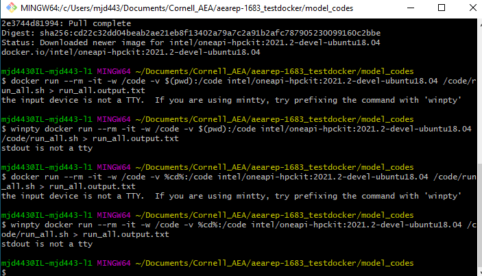

# Docker on Windows

**NOTE:** *This document is a work in progress.*

### Install

- Follow these [instructions](https://docs.docker.com/docker-for-windows/install/) to install Docker Desktop for Windows.
- Pay close attention to the system requirements:
    - WSL 2
    - Hyper-V

### Testing Setup

- Open up a command prompt and type `docker --version`. If working, it should output a Docker version and build number. 
- In the same shell, type `docker run hello-world` to test if your installation is working correctly. If working, you should get the following:
```
Hello from Docker!
This message shows that your installation appears to be working correctly.

To generate this message, Docker took the following steps:
 1. The Docker client contacted the Docker daemon.
 2. The Docker daemon pulled the "hello-world" image from the Docker Hub.
    (amd64)
 3. The Docker daemon created a new container from that image which runs the
    executable that produces the output you are currently reading.
 4. The Docker daemon streamed that output to the Docker client, which sent it
    to your terminal.
```

### Stata Imperfect Example

1. Start Docker Desktop. 
2. Download example project from [ICPSR](https://www.openicpsr.org/openicpsr/tenant/openicpsr/module/aea/workspace?goToPath=/openicpsr/118568&goToLevel=project#).
3. Open up a command prompt (cmd) and cd into the workspace folder you would like to place the project contents.
4. In the command line: `Unzip C:/path/to/Downloads/118568.zip`.
5. Download data from [here](https://www.icpsr.umich.edu/web/ICPSR/studies/13568/versions/V1/datadocumentation#) - Alaska only.
6. Unzip into "data" folder. 
7. Test Docker: `docker --version` or `docker run hello-world`.
8. Navigate to dataeditor [dockerhub](https://hub.docker.com/u/dataeditors) and click on the Stata version you have on your workspace > Tags > Copy the docker pull command, i.e.: `docker pull dataeditors/stata16:2021-06-09`
9. Paste into command line.
10. Set version: `set VERSION="16"` and image: `set IMG="dataeditors/stata16:2021-06-09"`.
11. Test with: `echo %VERSION%`
12. Run the Docker image:
```
   docker run -it --rm ^
  -v C:/path/to/stata_license/stata.lic.%VERSION%:/usr/local/stata%VERSION%/stata.lic ^
  -v %cd%/programs:/programs ^
  -v %cd%/data:/data ^
  %IMG% 
```
13. This opens an interactive Stata session. Next, cd into the "programs" folder: `cd /programs`
14. Execute the master file: `do master.do`
15. Hit error: 
```
save `dtahu', replace  /* save housing unit data */
(note: file /programs/../data/outputdata/housing.dta not found)
file /programs/../data/outputdata/housing.dta could not be opened
r(603);
```
16. Looks like there's no folder "data/outputdata/". A global was already defined for this so we can just `cap mkdir $outputdata` to create that folder. Re-run `master.do`.
17. Another error: `command latab is unrecognized`. Install the "latab" package and re-run.
18. No "tables" folder in the root directory to send the output tables to. However, this folder wasn't mapped to the Docker image so we'll have to create the directory and map it in our docker run command.
19. End the Stata session: `exit, STATA clear`.
20. Make the tables directory from the command line: `mkdir tables`.
21. Adjust the docker run command to account for the results folder:
```
   docker run -it --rm ^
  -v C:/Users/mjd443/Documents/aea-licenses/stata.lic.%VERSION%:/usr/local/stata%VERSION%/stata.lic ^
  -v %cd%/programs:/programs ^
  -v %cd%/data:/data ^
  -v %cd%/tables:/tables ^
  %IMG% 
```
22. Done!


### Fortran Example (aearep-2367)

1. Downloaded the [Intel OneAPI-hpckit](https://hub.docker.com/r/intel/oneapi-hpckit/tags?page=1&ordering=last_updated) by entering the following into the command line:
```docker pull intel/oneapi-hpckit:2021.2-devel-ubuntu18.04```

2. Navigate to the directory with all the Fortran model codes: ```cd PATH/to/model_codes```
3. Hit multiple issues attempting to run in Bash shell:
   
4. On Windows 10, opened a Command Prompt (cmd) instead.
5. Typed the following into the command line to run the shell script which executes all Fortran code:
```docker run --rm -it -w /code -v %cd%:/code intel/oneapi-hpckit:2021.2-devel-ubuntu18.04 /code/run_all.sh > run_all.output.txt```
   - This maps the current directory (model_codes) to the docker image as "/code" and runs `run_all.sh`, creating the log file `run_all.output.txt`. 


