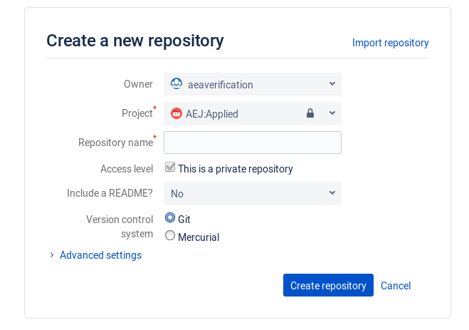
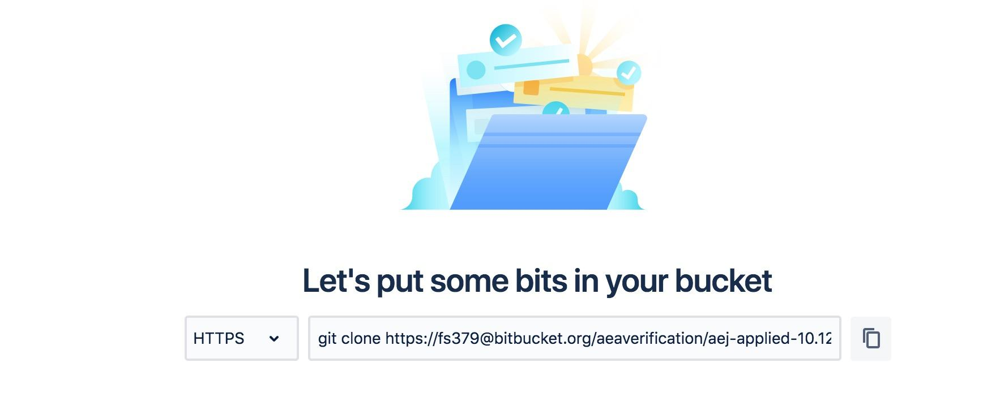
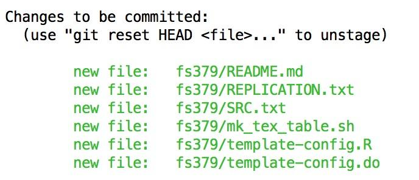

Agenda
======

Offline:

-   Setting up Git on personal computers (Mac, Windows)

<!-- -->

-   Requesting computer accounts (CISER)

5h-7h: Example of replication of a paper

→ 5h-5h45 Git/Bitbucket setup and training

→ 5h45-7h Entry questionnaire and replication of article
10.1257/app.6.2.152

7h00: end of training

TRAINING CHEAT SHEET 
=====================

Installing Git on your computer
-------------------------------

See https://git-scm.com/book/en/v2/Getting-Started-Installing-Git

### Windows

-   You can obtain both a graphical interface and a command line
    > interface by installing TortoiseGit
    > ([*https://tortoisegit.org/*](https://tortoisegit.org/))

-   You can get a command line "terminal" by hitting the Windows key
    > {width="0.5052088801399826in"
    > height="0.5052088801399826in"} and typing either "cmd" or
    > "powershell". You can now use the same commands as on OSX and
    > Linux.

-   If using CISER systems, you do not need to install git.

### Mac

-   To obtain a command line "terminal" on OSX, hit the "Command" key
    > and "space", type "terminal" and hit enter.

-   you can install git on a Mac simply by trying to run *git* from the
    > Terminal the very first time:

\$ git --version

-   If you don’t have it installed already, it will prompt you to
    > install it from the Xcode Command Line tools

-   You can also install a more recent version from
    > [*http://git-scm.com/download/mac*](http://git-scm.com/download/mac)

Learning the basics of Git
--------------------------

In general, we will provide you with the command line instructions for
git. Graphical interfaces may allow you to do the same thing, but the
command line instructions are identical across all platforms and
operating systems.

Follow the instructions at
[*https://git-scm.com/docs/gittutorial*](https://git-scm.com/docs/gittutorial).
For hands-on, make the following adaptations:

-   Instead of project.tar.gz use
    > [*https://www.aeaweb.org/aej/app/data/0602/2012-0292\_data.zip*](https://www.aeaweb.org/aej/app/data/0602/2012-0292_data.zip)

-   Unzip it in a folder of your choice

-   Move into the unzipped folder using “cd path/to/folder” in your
    > terminal window, where path/to/folder is the path to the folder

-   Put the folder under version control using “git init”

-   Follow the other instructions in the tutorial

 **Set up files for replication** 
==================================

**(Git Cheatsheet:
https://services.github.com/on-demand/downloads/github-git-cheat-sheet/)**

-   Organize your local working space. We suggest creating a directory
    > **Documents/Workspace**, and underneath it, create a directory for
    > each article, e.g., create a directory “**app.6.2.152**”

-   Go to the next step to initialize or clone the Git repository for
    > this replication

Create a repository on Bitbucket
--------------------------------

While you did the first test on Github.com, we will be using
Bitbucket.org for the AEA-related repositories. In particular, go to the
"aeaverification" team:
[*https://bitbucket.org/aeaverification/profile/repositories*](https://bitbucket.org/aeaverification/profile/repositories)

-   For each Paper, create a new repository, unless one already exists:

{width="6.5in" height="4.569444444444445in"}

-   Repository name should be "\[journal\]-\[doi\]", where

    -   "\[journal\]" may be "aej-applied", "aer", "aej-macro" etc.

    -   \[doi\] will be "10.1257-app.6.2.152"

    -   (replace all spaces and "/" with "-")

-   Keep the other settings (in particular, keep this a private
    > repository).

-   If a repository for that paper already exists (you are a second
    > replicator), proceed to the next step

Clone and populate the repository
---------------------------------

Proceed as follows:

-   Open a terminal at the repository location (varies by operating
    > system)

-   Clone the repository as per the instructions on the Bitbucket page:

{width="6.5in" height="2.5833333333333335in"}

-   In words:

\$ git clone
https://fs379@bitbucket.org/aeaverification/aej-applied-10.1257-app.6.2.152.git

-   You will now have a directory called "aej-applied-...". Enter it,
    > and create a directory with your NETID: e.g., "**fs379**"

-   Download the template from [*this
    > link*](https://github.com/AEADataEditor/replication-template/releases/latest/),
    > and unpack it into the newly created directory (only keep the
    > files, do not keep the directory called "replication-template")

-   Add the template files to your repository:

-   git add fs379

-   Make sure you are in the correct directory before issuing the git
    > add command (you should be in the “aej-applied…” directory)

-   If you type "git status", your directory should now look like this:

{width="4.359375546806649in"
height="1.8764982502187226in"}

-   You should now commit this initial set of files: "git commit -m
    > "Importing the template" **EVERY COMMIT requires a COMMIT
    > MESSAGE.**

-   Now download the code and data archive, e.g.,
    > [*https://www.aeaweb.org/aej/app/data/0602/2012-0292\_data.zip*](https://www.aeaweb.org/aej/app/data/0602/2012-0292_data.zip)
    > . Unzip it, maintaining the directory structure:

-   Delete the ZIP file.

-   You should now add and commit all program files, but ignore the data
    > files!

-   You are now set up to start assessing and replicating this article!

**ii)** **fill in entry questionnaire (the training ones as below, only for the training)**
-------------------------------------------------------------------------------------------

- Entry

*<https://docs.google.com/a/cornell.edu/forms/d/1VM7gP37aY1M2VXNvTgHZsISAT5dVFlX8wt13TOqSOb8/edit?usp=drive_web>*

Scale for the difficulty question:

[*https://drive.google.com/open?id=1wPP60YiqeaXsO8gqAJZ1TbDNy7TsJXST*](https://drive.google.com/open?id=1wPP60YiqeaXsO8gqAJZ1TbDNy7TsJXST)

iii) Prepare and run the replication 
-------------------------------------

Note: don’t forget to create a config.do to create the basepath:

-   create a configuration file with the following names

    -   Stata: config.do

    -   R: config.R

-   Any base path should be added here, as a
    > programming-language-specific macro variable:

    -   Stata: global basepath "/path/to/base/directory";

    -   R: basepath &lt;- "/path/to/base/directory"

-   Check if the author's programs create a logfile. If not, add sample
    > code to create such a logfile to the "config" file (the template
    > config file already contains code for this):

    -   Stata:\
        > local c\_date = c(current\_date)\
        > local cdate = subinstr("\`c\_date'", " ", "\_", .)\
        > log using "logfile\_\`cdate'.log", replace text

-   In the author's programs, as you work your way through, add lines
    > that call the config file, and modify any paths for files being
    > read to where they can be found on your replication system, using
    > BASEPATH as a replacement for the greatest part of the filepath.
    > Example:

    -   Stata:

        -   do "config.do"

        -   global myfile "\${basepath}/data/thisfile.csv"

Also: Important to keep note in REPLICATION.txt about whether you change
the directory, or any issue/progress you make on the replication.

Example of commands::

pwd

cd
/Users/sylverieherbert/Documents/Workspace/app.5.3.1/replication-sh2258

svn status

svn add \*log

svn ci -m "All the changes I made to make the code work on the system"

iv) fill in exit questionnaire
------------------------------

- Exit

[*https://docs.google.com/a/cornell.edu/forms/d/1H0p9aBy19gnec5omrTnU5xMqB6zH925E1kEbaohX3d8/viewform*](https://docs.google.com/a/cornell.edu/forms/d/1H0p9aBy19gnec5omrTnU5xMqB6zH925E1kEbaohX3d8/viewform)

Adding commit messages

Refer to
[*https://confluence.atlassian.com/bitbucket/use-smart-commits-298979931.html*](https://confluence.atlassian.com/bitbucket/use-smart-commits-298979931.html)
for the format. You need the issue tag (e.g., "AEJAPPLIED-2"), and need
to include it in your commit message, e.g.,

Git commit -m "AEJAPPLIED-2 \#comment This solves the first problem."

Note:

-   The tag "AEJAPPLIED-2" (yours will vary) needs to be in EXACTLY that
    > format (all caps, dash, no spaces). Typos won't work.

-   The part "\#comment " is required if you want it to show up in the
    > ticket. Any text elsewhere in the commit message will be viewable
    > under "Commits" and will show up in the repository as well.

