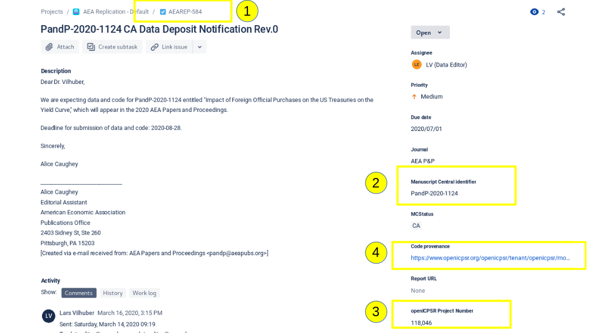

# Instructions for PandP checks

You will be assigned a Jira issue. It should look something like this:

Take note of the 4 highlighted fields:

-   \(1) the "AEAREP" number (identifier for the issue on Jira)

-   \(2) the "Manuscript Central Number" (identifier on the AEA's editorial system)

-   \(3) the "openICPSR Project Number" (identifier on the ICPSR system)

-   \(4) the link for "Code Provenance", which should direct you directly to openICPSR

Additionally, certain steps below (i.e. transitioning to "Pending Publication") require that you have "Publisher" permission in Jira. If it is unclear whether or not you have that permission, please reach out to a supervisor.  

> Here's the guidance document:
[https://aeadataeditor.github.io/aea-de-guidance/data-deposit-aea-guidance.html](https://aeadataeditor.github.io/aea-de-guidance/data-deposit-aea-guidance.html)

## Step 1

You should now do the following:

-   Open the link in (4) on openICPSR

    -  If you need to find the openICPSR repository, use this link: [https://www.openicpsr.org/openicpsr/tenant/openicpsr/module/aea/reports](https://www.openicpsr.org/openicpsr/tenant/openicpsr/module/aea/reports)
    
<!-- -->

-   Open the form: [link here](https://docs.google.com/forms/d/e/1FAIpQLSfcc4JDJsHRHZpkdBuNwbjYusjIsbSTXK6pZyuUBC7HyUW8iQ/viewform?usp=pp_url)

-   Assess the openICPSR repository, filling out the form as you go along

    -   It is important that you enter the AEAREP and Manuscript numbers accurately. We suggest copying-and-pasting.
    -   Quickly assess the README.

-   Submit the form.

- Close the form after each issue, and open it again for the next one.

- Navigate to the "PandP Docs" Google Drive folder [here](https://drive.google.com/drive/folders/1h5AiNQjlCTGPU3bICpqGoNqorzlc8yPb), locate the PDF with the Jira ticket of the case you are working on (PDF format: `Report-PandP-AEAREP-xxxx.pdf`), and download the file. This is the PDF version of the checklist form using the information you entered.

In Jira:

-   Move the issue forward by choosing "**Process PandP**" to status
     "*Submitted PandP Form*"
    -   This indicates that you have completed the form.
-   Attach the downloaded PDF to the Jira ticket.
-   Fill out the `DCAF_README_compliant` field under the `Repl. info` tab. If the README utilized the data editor template, check `Fully`. If the README did not use the template, but has all the information that we require check `Content only`. Finally, if the README does not satisfy either of those conditions, check `No`. 

## Step 2

Once the form PDF has been added to the issue, you should first return to the openICPSR repository, and then come back to Jira. Depending on what's on the form, proceed to do one of the following:

### If the form has all "required" elements checked, you should "sign off":

#### On openICPSR
- Write a "Project communication log" entry. After clicking on "+ add entry", copy the following to the relevant cell. Update AEAREP number accordingly.
    -   *Subject line:* AEAREP-xxx Data and Code Deposit for P&P submission accepted

    -   *Content*: Thank you for uploading your code and data. This
         deposit is accepted. No computational verification was
         conducted, only compliance with required metadata was checked.

#### Back in Jira
- Move it through the workflow

    -   Choose "**Prepare for publication**"
        -   Resolution: *Evaluation only*
        -   MCRecommendationV2: *Accept*

### If the form does not have all "required" elements checked, make the following entry:

#### On openICPSR
1) If `Deposit Status` = `Deposit in Progress`, 
- Write a "Project communication log" entry

    -   *Subject line:* AEAREP-XXX Modifications to make to your P&P
        deposit

    -   *Content:* Thank you for uploading your code and data. We have
         checked the deposit for compliance with the required metadata
        elements. Please see the attached form for modifications to
         make.

    -   Attach the PDF from the issue to the communication log.

2) If `Deposit Status` = `Submitted`, 
- Change the status of the deposit to "Request Revisions" with the note:
    -   Please see the attached form for modifications to make.
    
-   Write a "Project communication log" entry

    -   *Subject line:* AEAREP-XXX Modifications to make to your P&P
        deposit

    -   *Content:* Thank you for uploading your code and data. We have
         checked the deposit for compliance with the required metadata
        elements. Please see the attached form for modifications to
         make.

    -   Attach the PDF from the issue to the communication log.

#### Back in Jira,
- Choose "**Wait for openICPSR response (PandP)**"
    -   Resolution: "*Evaluation only*"
        -   MCRecommendationV2 = "Accept with changes"

-   Later, once the issues have been resolved (typically days or
        weeks later) follow the process under "required elements
        checked"
