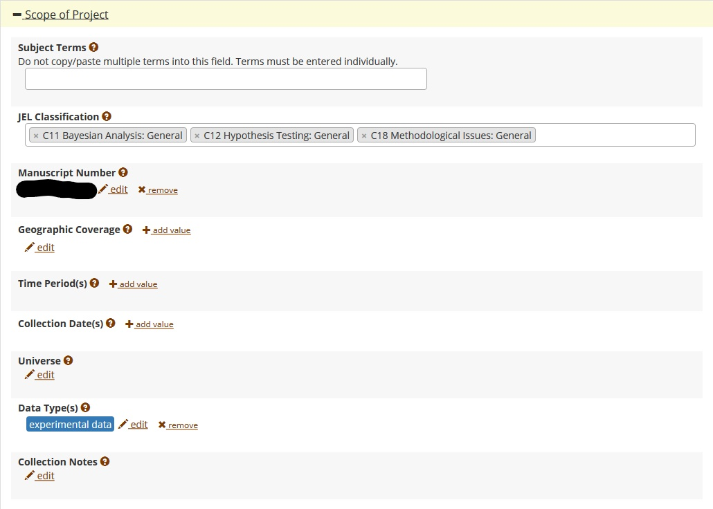

# A guided walk through the Replication Report

 + [Template REPORT](https://github.com/AEADataEditor/replication-template/blob/master/REPLICATION.md)
 + [Elements of a replication report](Replication-Report-Overview.pdf)
 + [Example 1](sample_report.md), [Example 2](REPLICATION-AEAREP278.md), [Example 3](REPLICATION-AEAREP282.md) and its [revision](REPLICATION-AEAREP282-revised.md)

---

## Some high-level concepts


###  (30 min) [Data documentation](https://social-science-data-editors.github.io/guidance/Requested_information_data.html)
  + Identifying all data
  + What is great / good / just-good-enough data documentation
  + Citing data!

###  (30 min) [Code and documentation](https://social-science-data-editors.github.io/guidance/Requested_information_code.html)
  + What do we consider to be "code"
  + Assessing the quality of the code documentation
  + How to modify code for replicability/verification

---

## Annotated REPLICATION.md

You may want to consult [Unofficial Verification Guidance](https://social-science-data-editors.github.io/guidance/Verification_guidance.html) for additional tips and criteria.

---

### SUMMARY

> INSTRUCTION: The Data Editor will fill this part out. It will be based on any [REQUIRED] and [SUGGESTED] action items that the report makes a note of. 

> INSTRUCTION: ALWAYS do "Data description", "Code description". If data is present, ALWAYS do "Data checks". If time is sufficient (initial assessment!), do "Replication steps", if not, explain why not.

---

### Data description (raw data)


> INSTRUCTIONS: Identify all data sources. Create a list (and commit the list together with this report) (not needed if filling out the "Data Citation and Information report"). For each data source, list in THIS document presence or absence of source, codebook/information on the data, and summary statistics. Summary statistics and codebook may not be necessary if they are available for public use data. In all cases, if the author of the article points to an online location for such information, that is OK. Check for data citation. IN THIS DOCUMENT, point out only a summary of shortcomings.

---
Examples:

#### FRED Data
- Variables sourced from the Federal Reserve Economic Database
  - Federal funds rate
    - Intended rate, or midpoint of target range sourced from FRED
    - Data is provided in postedData.csv and described in README
  - U.S. CPI data
    - provided in postedVARData.csv; the authors also provide a link to the data
- Citation: Source is not formally cited in References section

> [REQUIRED] Please add data citations to the article. Guidance on how to cite data is provided in the [AEA Sample References](https://www.aeaweb.org/journals/policies/sample-references).

Suggested citation as per FRED website at the URL provided by the authors:

> Suggested Citation:
>
> >U.S. Bureau of Labor Statistics, Consumer Price Index for All Urban Consumers: All Items in U.S. City Average [CPIAUCSL], retrieved from FRED, Federal Reserve Bank of St. Louis; https://fred.stlouisfed.org/series/CPIAUCSL, January 13, 2020.


### Equity index, Mexico
- Sourced from Haver Analytics
- Labeled as censored by authors, so not included in replication package
- Authors include the Haver mnemonic in the README: S273IPC@INTDAILY
- Citation: Source is not formally cited in References section

> [REQUIRED] Please add data citations to the article. Guidance on how to cite data is provided in the [AEA Sample References](https://www.aeaweb.org/journals/policies/sample-references).

---

### Data description (analysis data)

> INSTRUCTIONS: List the analysis data files provided. These will be the datasets that are read by the table/figure generating programs. Sometimes, cleaning and analysis are done in one step (no intermediate analysis data exists).

---

#### ICPSR data deposit

> INSTRUCTIONS: Most deposits will be at openICPSR, but all need to be checked for complete metadata. Detailed guidance is at [https://aeadataeditor.github.io/aea-de-guidance/data-deposit-aea-guidance.html](https://aeadataeditor.github.io/aea-de-guidance/data-deposit-aea-guidance.html). 



- [ ] JEL Classification (required)
- [ ] Manuscript Number (required)
- [ ] Subject Terms (highly recommended)
- [ ] Geographic coverage (highly recommended)
- [ ] Time period(s) (highly recommended)
- [ ] Collection date(s) (suggested)
- [ ] Universe (suggested)
- [ ] Data Type(s) (suggested)
- [ ] Data Source (suggested)
- [ ] Units of Observation (suggested)

> INSTRUCTIONS: Go through the checklist above, and then choose ONE of the following results:

- [NOTE] openICPSR metadata is sufficient.

or

- [REQUIRED] Please update the required fields listed. 

and/or

- [SUGGESTED] We suggest you update the fields marked as (suggested) above, in order to improve findability of your data and code supplement. 

For additional guidance, see [https://aeadataeditor.github.io/aea-de-guidance/data-deposit-aea-guidance.html](https://aeadataeditor.github.io/aea-de-guidance/data-deposit-aea-guidance.html).

---

### Data checks

> INSTRUCTIONS: When data are present, run checks:
> - can data be read (using software indicated by author)?

> - Is data in archive-ready formats (CSV, TXT) or in custom formats (DTA, SAS7BDAT, Rdata)?

> - Does the data have variable labels (Stata: run `describe using (name of DTA)` and check that there is content in the column "variable label")?

> - Run check for PII ([PII_stata_scan.do](PII_stata_scan.do), sourced from [here](https://github.com/J-PAL/stata_PII_scan) if using Stata) and report results. Note: this check will have lots of false positives - fields it thinks might be sensitive that are not, in fact, sensitive. Apply judgement.


Note that we have **NOT** required that variable values are here, nor that a full codebook is present or linked. Ideally, these would be here as well, and in some cases, we will go back to the authors and request them, **IF** we think it is reasonable to do so (judgement call).

---

### Code description

> INSTRUCTIONS: Review the code (but do not run it yet). 

> INSTRUCTIONS: **Cleaning code:** Is there code that transforms the raw data files (listed above) into the (provided) analysis data?

> INSTRUCTIONS: **Analysis code:** Identify all **Figure, Table, and any in-text numbers**. Create a list, mapping each of them to a particular program and line number within the program (use [this template](code-check-TEMPLATE.xlsx)). Commit that list. You will come back to the list in your findings. IN THIS SECTION, point out only a summary description, including of shortcomings. E.g.

There are four provided Stata do files, three Matlab .m files, including a "master.do". 
- Table 5: could not identify code that produces Table 5
- Neither the program codes, nor the README, identify which tables are produced by what program.

> INSTRUCTIONS: You could generate list of all code files using the (Git) Bash shell:
> ```find . -name \*.do```
> will find all files ending in `.do `. That list can be provided.

```
programs/master.do
programs/table1.do
programs/table2.do
programs/figure1.do
programs/table3.do
programs/table4.m
programs/figure2.m
```

> NOTE: In-text numbers that reference numbers in tables do not need to be listed. Only in-text numbers that correspond to no table or figure need to be listed.

*What can go wrong?*

- Not all code is provided. Frequently missing:
  - Appendix code
  - Transforming *raw* data into *analysis* data
- Code does not identify where specific tables/figures/numbers are created
  - Ideally: one program per table/figure, called from master program
  - Also feasible: Labels within the programs
  - Issues: 
    - no labels
    - Mnemonic tables without numbering (`table_ols_fe.csv`)
    - No comments at all...

---

### Replication steps


> INSTRUCTIONS: provide details about your process of accessing the code and data.
> Do NOT detail things like "I save them on my Desktop".
> DO describe actions   that you did  as per instructions ("I added a config.do")
> DO describe any other actions you needed to do ("I had to make changes in multiple programs"), without going into detail (the commit log can provide that information)

Example:
1. Downloaded code from URL provided.
2. Downloaded data from URL indicated in the README. A sign-up was required (not indicated in README)
3. Added the config.do generating system information, but commented out log creation, as author already creates log files.
4. Ran code as per README, but the third step did not work.
5. Made changes to the way the third step is run to get it to work.

### Computing Environment

> INSTRUCTIONS: This might be automated, for now, please fill in manually. Remove examples that are not relevant, adjust examples to fit special circumstances. Some of this is available from the standard log output in Stata. These can be found by right-clicking on "My PC" (for a PC), "About this Mac" (for a Mac), and a combination of "free -g" and "cat /proc/cpuinfo" on Linux.

- Mac Laptop, 8 GB of memory
- CISER Shared Windows Server 2016, 256GB, Intel Xeon E5-4669 v3 @ 2.10Ghz (3 processors)
- CISER Virtual Windows Server 2016, 16GB, Intel Haswell 2.19 Ghz (2 processors)
- BioHPC Linux server, Centos 7.6, 64 cores; 1024GB RAM; 

> INSTRUCTIONS: Please also list the software you used (specific versions). List only the ones you used, add any not listed in the examples:

- Stata/MP 16
- Matlab R2019a
- Intel Compiler 3.14152

>> !!! NEW !!!

> INSTRUCTIONS: List the (approximate) time the code ran. This would be added here AFTER you've run the code!

Runtime: 30 min

or

Runtime: approx. 20 days

> > Up through this part, you have not needed to run the code !! - We call this the "Preliminary Report". So go ahead, and commit THIS document to the repository.

> > Now we actually run the code.


### Findings

> Describe your findings both positive and negative in some detail, for each **Figure, Table, and any in-text numbers**. You can re-use the Excel file created under *Code Description*. When errors happen, be as precise as possible. For differences in figures, provide both a screenshot of what the manuscript contains, as well as the figure produced by the code you ran.

#### Tables
- Table 1: Looks the same
- Table 2: (contains no data)
- Table 3: Minor differences in row 5, column 3: 
  - Reproduced: **0.003** 
  - Manuscript:  **0.3**

#### Figures
> INSTRUCTIONS: Please provide a comparison with the paper when describing that figures look different. Use a screenshot for the paper, and the graph generated by the programs for the comparison. Reference the graph generated by the programs as a local file within the repository.

Example:
- Figure 1: Looks the same
- Figure 2: no program provided
- Figure 3: Paper version looks different from the one generated by programs:

Paper version:


Figure 3 generated by programs:


#### In-Text Numbers
> INSTRUCTIONS: list page and line number of in-text numbers. If ambiguous, cite the surrounding text, i.e., "the rate fell to 52% of all jobs: verified".

[ ] There are no in-text numbers, or all in-text numbers stem from tables and figures.

[ ] There are in-text numbers, but they are not identified in the code

Example:
- Page 21, line 5: Same


### Classification

> INSTRUCTIONS: Make an assessment here.
>
> Full replication can include a small number of apparently insignificant changes in the numbers in the table. Full replication also applies when changes to the programs needed to be made, but were successfully implemented.
>
> Partial replication means that a significant number (>25%) of programs and/or numbers are different.
>
> Note that if any data is confidential and not available, then a partial replication applies. This should be noted on the "Replication assessment questionnaire"/ JIRA.
>
> Note that when all data is confidential, it is unlikely that this exercise should have been attempted.
>
> Failure to replicate: only a small number of programs ran successfully, or only a small number of numbers were successfully generated (<25%)

- [ ] full replication
- [ ] full replication with minor issues
- [ ] partial replication (see above)
- [ ] not able to replicate most or all of the results (reasons see above)