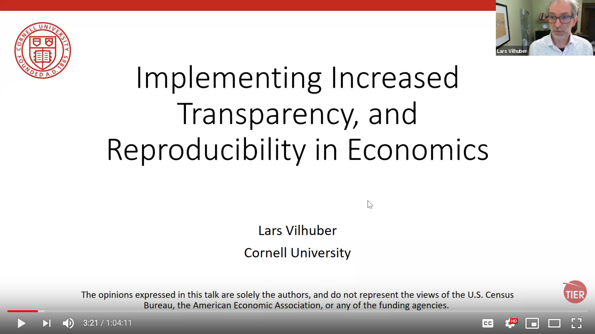

TRAINING For Reproducibility Verification
=========================================

 

> Training will occur virtually, through a combination of required self-study and live Zoom meetings. 
> - The live part of the training will take place as planned Wednesday and Thursday, March 25th and 26th, from 6-8 PM Eastern Time both days. 
> - If your application to the LDI Replication Lab was accepted,  you will be receiving a calendar invite with the Zoom information on Monday. 
> - All the remaining information here is open to anybody. 
> - Content is .

prior to 25 March  2020
------

Please do the following:

- Review our [Video Etiquette rules](https://github.com/labordynamicsinstitute/replicability-training/wiki/Videoconferencing-Rules-and-Etiquette) (they are useful beyond our group as well)
- View [my recent talk on the background of the lab](https://www.projecttier.org/fellowships-and-workshops/weekly-webcast-leaders-research-transparency/replication-and-reproducibility-social-sciences-and-statistics-context-concerns-and-concrete-measures/) (or directly [here](https://www.youtube.com/watch?v=rLoeNzOApFk)), including what we do, and why we do it. 

+ Review our [Privacy](Privacy.md) policy
  + Your Privacy
  + The privacy of authors

+ Go through our [Setup Checklist](setup_checklist.md) and install necessary software

25 March 2020, 6PM - 8PM EST
---------------------------

###  6:00 - 6:15 PM EST Overview

+ Welcome!
+ Q+A regarding the [talk](https://www.projecttier.org/fellowships-and-workshops/weekly-webcast-leaders-research-transparency/replication-and-reproducibility-social-sciences-and-statistics-context-concerns-and-concrete-measures/) and the [Privacy](Privacy.md) policy

+ [What will you be doing in this Lab](Overview_lab.md)
+ Some websites to bookmark:
    - [AEA Guidance](https://aeadataeditor.github.io/aea-de-guidance/)
    - [Social Science Data Editor Guidance](https://social-science-data-editors.github.io/guidance/)
    - [Replication template](https://github.com/AEADataEditor/replication-template)

### 6:15 - 7:00 PM EST: A prototypical replication report
+ [Template README](https://github.com/AEADataEditor/aea-de-guidance/blob/master/template-README.md) ([pretty version](https://aeadataeditor.github.io/aea-de-guidance/template-README.html))
+ [Template REPORT](https://github.com/AEADataEditor/replication-template/blob/master/REPLICATION.md)
+ [Elements of a replication report](Replication-Report-Overview.pdf)
+ [Example 1](sample_report.md), [Example 2](REPLICATION-AEAREP278.md), [Example 3](REPLICATION-AEAREP282.md) and its [revision](REPLICATION-AEAREP282-revised.md)

### 10:15 - 10:30 PM EST Break

### 10:30 AM - 12:00 PM EST Details on Replication Report Elements

+ [A guided walk through the Replication Report](Details_Replication_Report.md)

### 12:00 - 12:30 PM EST Lunch and Networking

Sandwiches in Doherty Lounge (Ives 281) 

### 12:30 - 1:00 PM EST Technical setup
Providing you with the tools to do replicable science right, and efficiently.
+ Cornell-specific:
  + Get [Access to computers](Access_to_computers.md)
+ Software you will use
  - [Software](Software_for_replication_CISER.md)
  - [Software on your laptop](Installing_Software.md)
+ [Communication](Communication.md)

+ The [Command Line](https://github.com/labordynamicsinstitute/computing4economists/blob/master/Git_CL_Slides/intro_command_line.md)
+ The [basics of Git](Basics_of_Git.md) ([Cheatsheet for Git](https://www.atlassian.com/git/tutorials/atlassian-git-cheatsheet))
  + [Installing Git on your computer](https://github.com/labordynamicsinstitute/ldi-lab-standards/wiki/Setting-up-Git)
  + [Testing that Git works](Testing_that_Git_works.md)
+ [Installing Text editors](Installing_text_editors.md)  
+ The [basics of Markdown](Basics_of_Markdown.md) ([Online Cheatsheet](https://github.com/adam-p/markdown-here/wiki/Markdown-Cheatsheet), [Printable Cheatsheet](https://guides.github.com/pdfs/markdown-cheatsheet-online.pdf))
    

###  1:00 - 2:00 PM EST  [Reproducible practices](Reproducible_practices.md)
+ The ideal directory structure (common sense, TIER, variants) 
+ The prototypical data flow
+ Naming data and programs
+ Structuring programs

### 2:15 - 4:15 A Walkthrough of the workflow for unpublished articles

For unpublished articles, the assignment of articles occurs through **Jira**
+ [Pre-publication workflow for unpublished articles](../jira-workflow-training.md)
+ Start by assessing the article, citations, data
+ [Example](jira_replication_example.md)

