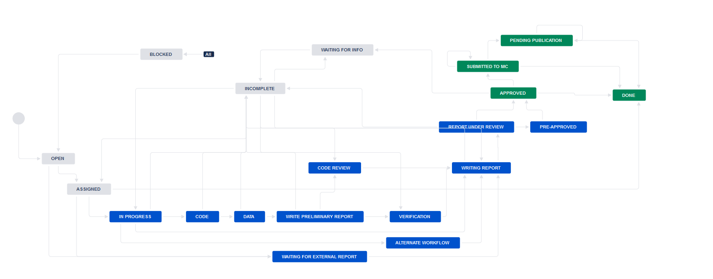

# Pre-publication Replication Example

Lars Vilhuber and David Wasser

November 2019

## Walking Through An Example

-   We will work through an example of a pre-publication replication
    together

-   Do each step on your computer or on CISER, as directed

-   Keep the [Wiki](https://github.com/labordynamicsinstitute/replicability-training/wiki) and the [Jira workflow](https://github.com/labordynamicsinstitute/replicability-training/blob/master/jira-workflow-training.md) open in another tab

## Outline

1. Access article and download materials
2. Create repo with template
3. Populate repo
5. JIRA Process
6. Verification
7. Committing and pushing to repo

## Create repo (do anywhere)

- Log on to JIRA 

-   Find the issue on JIRA and advance it from **Open** to **In
    Progress**

-   Repositories for AEA Verification are on
    [https://bitbucket.org/aeaverification/](https://bitbucket.org/aeaverification/)

-   Follow the instructions in the Wiki for [creating a new repo](https://github.com/labordynamicsinstitute/replicability-training/wiki/Setting-up-a-repository-on-Bitbucket)
    - You will want to use the `Import Repository` function to populate your new repo with the replication template materials. 

-   Repository name should be the same as the JIRA ticket number, e.g.
    `aearep-14` (when real) or `training-10`

- Go back to JIRA, and enter the SHORT repository name under "Bitbucket short name"

## Log on to CISER

We will start the process on CISER.

 - though not default, always use Firefox on CISER. Follow instructions when prompted to set it as your default.
 - Now is a good time to set up a space on CISER to store all your LDI Replication work. Create a directory in `Documents` called 
    “aea_workspace” (or something else you prefer)
    - this will be available on ALL CISER nodes!

## Clone the repo

- Log on to JIRA from CISER, using Firefox.

-   Find the issue on JIRA 
   - click on the "Git working location". This will take you back to your Bitbucket repo (you probably will need to logon again)
   - Click the "clone" button.

- Open Powershell (this is like terminal on a Mac) and navigate to the aea_workspace directory 
  - Powertip: If you have the "aea_workspace" open in the file navigation, type `powershell` in the address bar

-   Use `git clone` to get your Bitbucket repo and its contents into this folder
   - If you used the "clone" button, the entire command you need will be in your copy buffer.

## Access article and download materials

-   The PDF of the manuscript will be attached to the JIRA issue

-   The openICPSR project URL will already be in the Code Provenance field, click on it
        - If not, request access from the JIRA administrator (Lars or Meredith) via a note in the comments
-   Follow the [directions](https://github.com/labordynamicsinstitute/replicability-training/blob/master/openICPSR_training.md) on the wiki for downloading them.

-   You should see a project named “Training for AEA Replication Lab”

-   At the top, under the "more" button, click **Download Project**

## Populate repo

-   Follow the instructions in the Wiki for [populating a repo](https://github.com/labordynamicsinstitute/replicability-training/wiki/Populating_repository_for_replication)

-   Delete unneccessary files from the template: for this example, you should only save: REPLICATION.md, .gitignore,
    and SRC

- Download the manuscriptPDF  from the Jira issue and save in your repo

-   Save the downloaded materials from the openICPSR deposit in your repo (hint: they are probably in your downloads folder).

-   Now we will use git to `add`, `commit`, and `push` these files to Bitbucket

-   In the terminal, navigate to the repo. Then:

    1.  Use `git add` to add the appropriate files (careful!)

    2.  Commit:
        `git commit -m "REPO NAME #comment Write your commit message here"`

        -   This is “smart commit” that syncs JIRA and Bitbucket

    3.  Push: `git push -u origin master`

-   Check Bitbucket – your files should be there now

-   This replication is in Matlab, but most of the replications you do will be in Stata

-   The most important difference between the Stata process and the Matlab process is the `config.do` file in Stata (see the wiki for [help](https://github.com/labordynamicsinstitute/replicability-training/wiki/Prepare_and_run_replication) on this)

## Moving towards "Preliminary Report" - On laptop

Switch back to your laptop (do you know how?)

- Log on to JIRA and Bitbucket on your laptop
- Follow similar steps to create a "aea_verification" area on your computer.
- If using Mac, replace `Terminal` anywhere it says `Powershell` above
- Clone the repository to your laptop
- Check:
  - [ ] What files are NOT here?
  - [ ] How do you load a "`.m`" file or a "`.do`" on your laptop if you do not have Matlab or Stata installed?

## JIRA Process

-   Fill out the Jira fields according to the [training](https://github.com/labordynamicsinstitute/replicability-training/blob/master/jira-workflow-training.md). 

-   Go all the way through `Writing the Preliminary Report`.
    
## Verification

-   Let’s try to replicate Figure 1 
- Log on / switch to CISER again

-   Open `gen_figure1.m` in Matlab and run it

-   What do you find? 
   - Compare this to Figure 1 in the manuscript. 

## Committing and pushing to repo

-   After running the code, make sure to save any changes you made to the project code, the output you created, and your changes to the report. 
  - If the code wrote out a file with Figure 1, remember to add that
  - If it did not, you may want to manually save it
    - [ ] Should you make a note of that in the REPLICATION.md?

- Push everything to the remote Bitbucket repository using `git add`,  `git commit`, and `git push` again. 

-   Always remember: commit frequently, push (at least) daily. 

