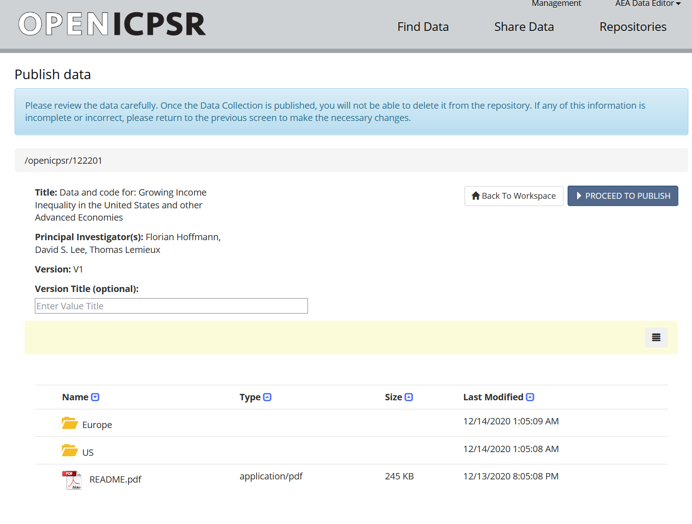
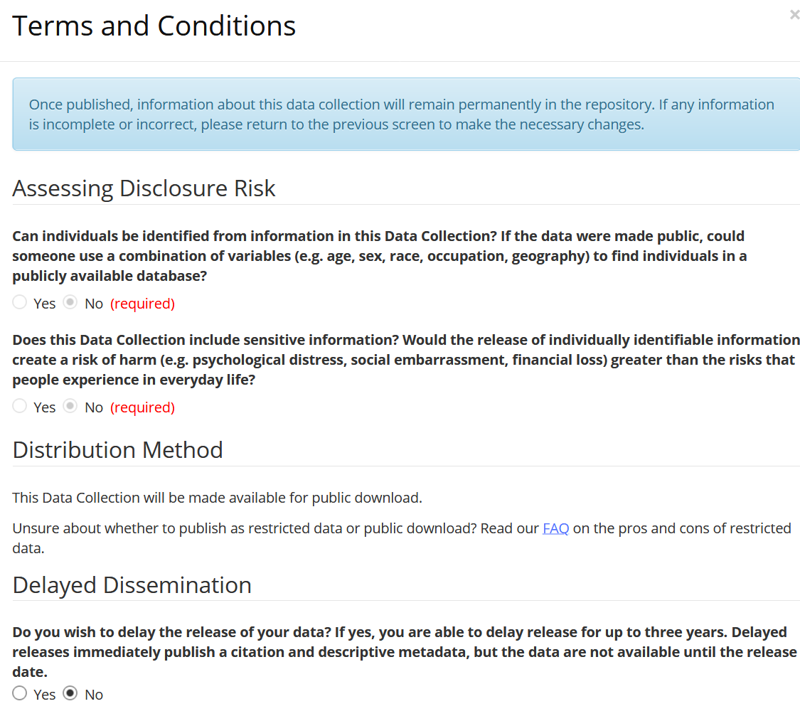

# Publishing a deposit

## Responsibilities

In general, publication of the deposit is done by the AEA Editorial Office, in synchronization with the publication of a the manuscript.

In certain circumstances, this may also be done by the AEA Data Editor's office.

## Pre-requisites (JIRA)

The openICPSR project number must be filled out. 

The correct openICPSR version number needs to be selected.

An openICPSR DOI needs to be present (if necessary, run a script).

## Move to "Processing Publication"

Select the transition "Publish" to move it to "Processing Publication". In the popup, verify that all information seems complete. 

In a separate tab, open the deposit. Verify that the usual "ready for publication"  communication entry has been added. 

- if not, investigate why

> Change Status -> Publish

Verify the information again, then "Proceed to publish".

Most of the values on the next screen should have been consented to by the authors. However,

- Verify that the data collection is scheduled for "public download." Only in rare cases will this be for restricted-access. 
- Verify that "Delayed dissemination" = "no". We never use that.

The remaining options are non-selectable. However, verify that the License is correctly chosen - if there is a license file in the deposit, there should be a "Other license" selected.

Choose "Publish Project". The project will go public shortly. You should verify that in fact the deposit is publicly accessible at the DOI. Any failure should be reported to openICPSR.
