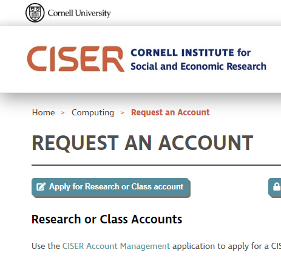

# Access to Computers

You will be working on a variety of computers
+ your laptop (Windows, OS X, Linux)
+ a Windows remote desktop at [CISER](https://ciser.cornell.edu/computing/) ([Login instructions](https://ciser.cornell.edu/computing/computing-help/how-to-login/))
+ a [Linux cluster](https://biohpc.cornell.edu/lab/lab.aspx) or [Linux server](https://www2.vrdc.cornell.edu/news/ecco/step-1-requesting-an-ecco-account/ecco-account-creation/)

## What can you do where
In principle, assuming you have the necessary software, you can work on any computer. Just remember to `git push` all changes back to Bitbucket.

## Where is the data
We are currently exploring how to make the data *mobile*. At present, we do not want the data in Bitbucket, so you will need to re-download the data on each computer you intend to **run programs**. So you should decide on one particular computer.

## What software
By default, you should expect to run the code on CISER, which has a [broad selection of software](https://ciser.cornell.edu/computing/software/).

If you actually have the software on your laptop, you should feel free to run code there, but see the caveat below. We will not purchase software for your personal laptop, and we do not provide you with a computationally capable laptop.

Some software is not available on CISER. If you encounter the following, you should check with your supervisor:

| Software | Computing resource |
|==========|====================|
| Dynare   | Red Cloud Windows node |
| Fortran compiler | BioHPC linux cluster |
| C compiler  | BioHPC linux cluster |
| Eviews | Not currently available |

Much statistical software loads data into memory. Your laptop has a limited amount of memory (in 2018, between 2GB and 8GB, rarely more). CISER nodes and BioHPC nodes can have between 256GB and 1024 GB of memory!

## What if the code runs for a long time / I need to run to class / I need my life = Twitter back on my laptop

One of the advantages of running on the CISER or BioHPC nodes is that you can *disconnect* from the server, while leaving your programs running. That is one of the reasons to use them instead of your laptop. 

## Requesting Access

https://ciser.cornell.edu/computing/request-an-account/

## Where can I learn more
+ For CISER nodes, see [here](https://ciser.cornell.edu/computing/computing-help/how-to-login/)
+ For special *Red Cloud* nodes, see [here](https://github.com/labordynamicsinstitute/replicability-training/wiki/Connect-to-a-Ciser-Custom-Red-Cloud-Machine)
