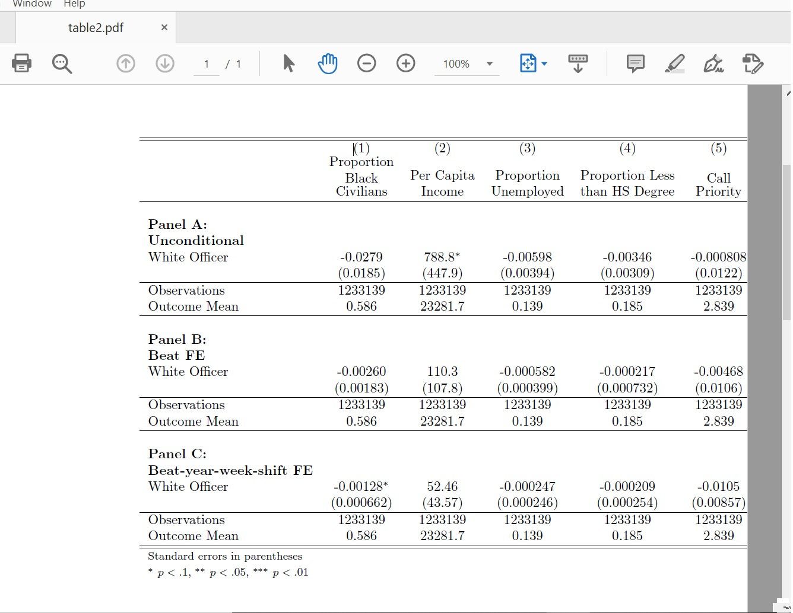
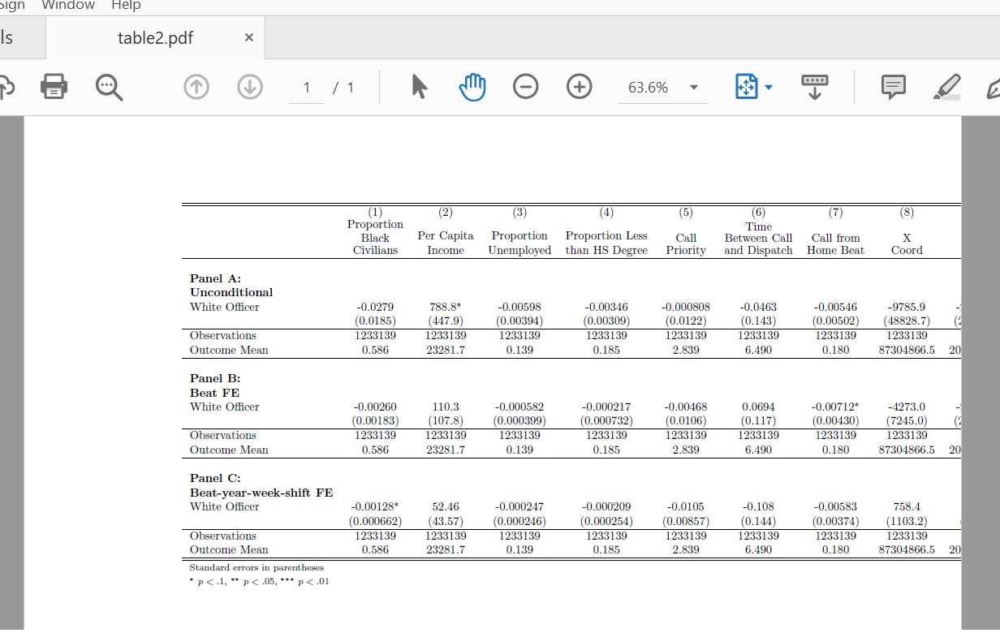
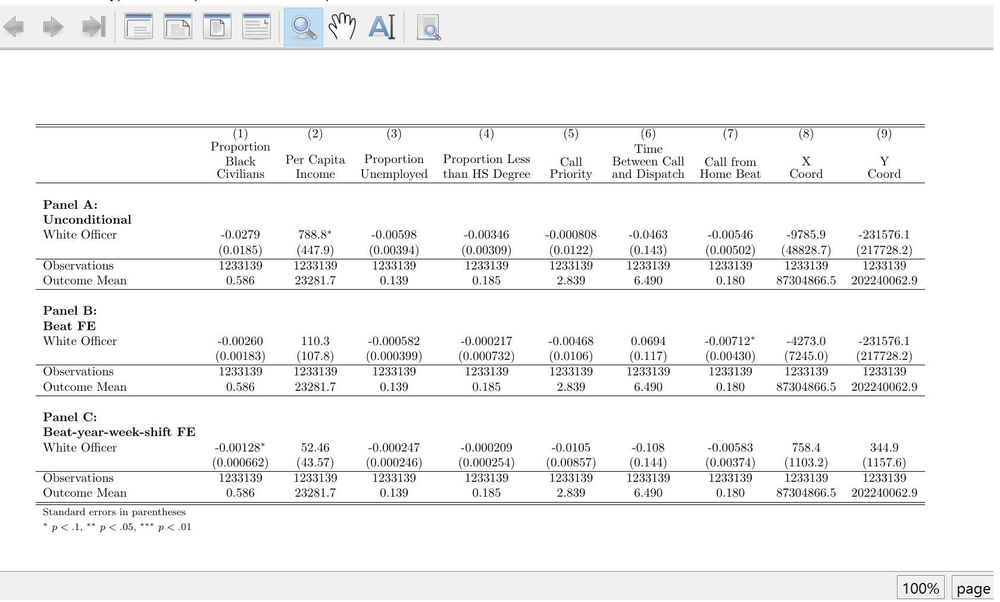
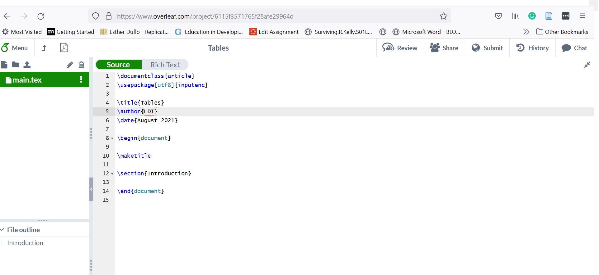
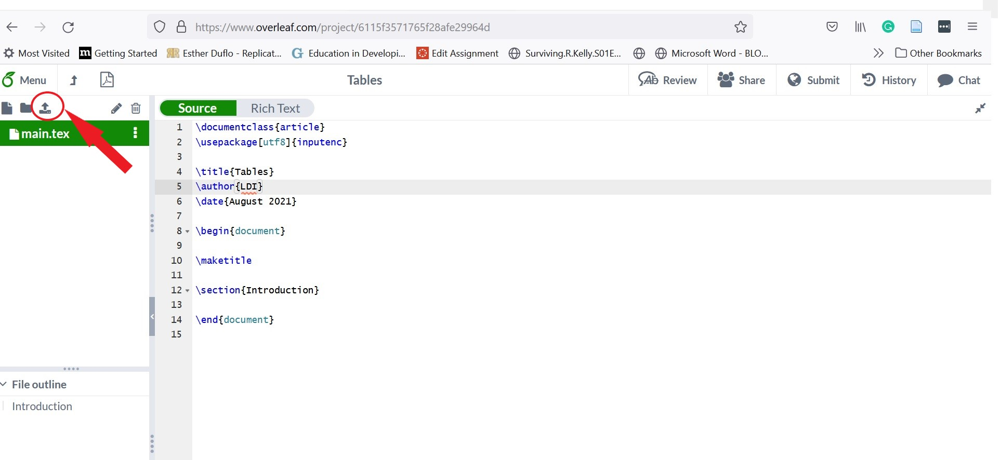
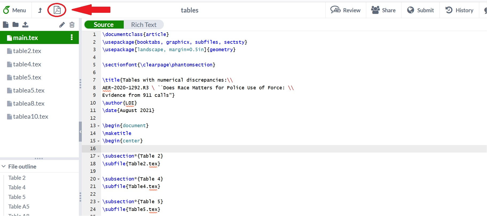

# Tips to produce PDF files from LaTex files containing only tables 

When running code to replicate economics papers, we will often see output tables in the form of .tex files. A common mistake is to think these files should produce .pdf files for a complete replication. That is not the case. We care only about whether the numbers in those files are the same as those in the manuscript's corresponding tables, and this is all you should check. The reason is that .tex files containing only tables are seldom meant to be compiled independently. 

However, there are at least two reasons why you may still want to produce a .pdf file from a .tex file with a nice formatted table in it:

 1. A manuscript table is so complex, it is too hard to assess whether it is right just by looking at the .tex file. 

 2. You found discrepancies, so you want to point to them in your report. 

If you find yourself in any of the above situations,  the following example might be of help.

## A real/typical example

Let's say you run code that outputs a .tex file, you open it, and are scared to find something like: 

```
{
\def\sym#1{\ifmmode^{#1}\else\(^{#1}\)\fi}
\begin{tabular}{l*{9}{c}}
\hline\hline
                    &\multicolumn{1}{c}{(1)}&\multicolumn{1}{c}{(2)}&\multicolumn{1}{c}{(3)}&\multicolumn{1}{c}{(4)}&\multicolumn{1}{c}{(5)}&\multicolumn{1}{c}{(6)}&\multicolumn{1}{c}{(7)}&\multicolumn{1}{c}{(8)}&\multicolumn{1}{c}{(9)}\\
                    &\multicolumn{1}{c}{\shortstack{Proportion \\Black \\ Civilians}}&\multicolumn{1}{c}{\shortstack{Per Capita \\ Income}}&\multicolumn{1}{c}{\shortstack{Proportion \\ Unemployed}}&\multicolumn{1}{c}{\shortstack{Proportion Less\\ than HS Degree}}&\multicolumn{1}{c}{\shortstack{Call \\ Priority}}&\multicolumn{1}{c}{\shortstack{Time \\ Between Call \\ and Dispatch}}&\multicolumn{1}{c}{\shortstack{Call from \\ Home Beat}}&\multicolumn{1}{c}{\shortstack{X \\ Coord}}&\multicolumn{1}{c}{\shortstack{Y \\ Coord}}\\
\hline \\ \textbf{Panel A:} \\\textbf{Unconditional} \\
White Officer       &     -0.0279         &       788.8\sym{*}  &    -0.00598         &    -0.00346         &   -0.000808         &     -0.0463         &    -0.00546         &     -9785.9         &   -231576.1         \\
                    &    (0.0185)         &     (447.9)         &   (0.00394)         &   (0.00309)         &    (0.0122)         &     (0.143)         &   (0.00502)         &   (48828.7)         &  (217728.2)         \\
\hline
Observations        &     1233139         &     1233139         &     1233139         &     1233139         &     1233139         &     1233139         &     1233139         &     1233139         &     1233139         \\
Outcome Mean        &       0.586         &     23281.7         &       0.139         &       0.185         &       2.839         &       6.490         &       0.180         &  87304866.5         & 202240062.9         \\


\hline \\ \textbf{Panel B:}\\ \textbf{Beat FE} \\
White Officer       &    -0.00260         &       110.3         &   -0.000582         &   -0.000217         &    -0.00468         &      0.0694         &    -0.00712\sym{*}  &     -4273.0         &   -231576.1         \\
                    &   (0.00183)         &     (107.8)         &  (0.000399)         &  (0.000732)         &    (0.0106)         &     (0.117)         &   (0.00430)         &    (7245.0)         &  (217728.2)         \\
\hline
Observations        &     1233139         &     1233139         &     1233139         &     1233139         &     1233139         &     1233139         &     1233139         &     1233139         &     1233139         \\
Outcome Mean        &       0.586         &     23281.7         &       0.139         &       0.185         &       2.839         &       6.490         &       0.180         &  87304866.5         & 202240062.9         \\


\hline \\ \textbf{Panel C:} \\ \textbf{Beat-year-week-shift FE} \\
White Officer       &    -0.00128\sym{*}  &       52.46         &   -0.000247         &   -0.000209         &     -0.0105         &      -0.108         &    -0.00583         &       758.4         &       344.9         \\
                    &  (0.000662)         &     (43.57)         &  (0.000246)         &  (0.000254)         &   (0.00857)         &     (0.144)         &   (0.00374)         &    (1103.2)         &    (1157.6)         \\
\hline
Observations        &     1233139         &     1233139         &     1233139         &     1233139         &     1233139         &     1233139         &     1233139         &     1233139         &     1233139         \\
Outcome Mean        &       0.586         &     23281.7         &       0.139         &       0.185         &       2.839         &       6.490         &       0.180         &  87304866.5         & 202240062.9         \\
\hline\hline
\multicolumn{10}{l}{\footnotesize Standard errors in parentheses}\\
\multicolumn{10}{l}{\footnotesize \sym{*} \(p<.1\), \sym{**} \(p<.05\), \sym{***} \(p<.01\)}\\
\end{tabular}
}

```

You want to compile this code to create a readable table, so you run the compiler. No matter which compiler you are using, you'll get an error. In my case, it says:

```
! LaTeX Error: Missing \begin{document}.
```
which is useful because it leads us to the first tip.

### 1. Add \documentclass{article}, \begin{document} at the beginning, and \end{document} at the end.

All .tex files, with tables or not, have the following structure:

```
\documentclass{something}
\begin{document}
A table here or not.
\end{document}

```
If that  basic structure is not present, the compilation won't works. You might wonder why .tex files with tables in them do not include the structure already. Well, as I mentioned before, .tex files with tables produced by code are not meant to be compiled independently. They are usually part of a bigger Latex document that already has the structure. 

Lets go back to our table from above. 
- We need to add, in the first line of our .tex file, \documentclass{article} ("article" is the most common class of document). 
- Next, we add \begin{document} in the second line.
- Finally, we add \end{document} after our table. 

Like this:
```
\documentclass{article}
\begin{document}

{
\def\sym#1{\ifmmode^{#1}\else\(^{#1}\)\fi}
\begin{tabular}{l*{9}{c}}
\hline\hline
                    &\multicolumn{1}{c}{(1)}&\multicolumn{1}{c}{(2)}&\multicolumn{1}{c}{(3)}&\multicolumn{1}{c}{(4)}&\multicolumn{1}{c}{(5)}&\multicolumn{1}{c}{(6)}&\multicolumn{1}{c}{(7)}&\multicolumn{1}{c}{(8)}&\multicolumn{1}{c}{(9)}\\
                    &\multicolumn{1}{c}{\shortstack{Proportion \\Black \\ Civilians}}&\multicolumn{1}{c}{\shortstack{Per Capita \\ Income}}&\multicolumn{1}{c}{\shortstack{Proportion \\ Unemployed}}&\multicolumn{1}{c}{\shortstack{Proportion Less\\ than HS Degree}}&\multicolumn{1}{c}{\shortstack{Call \\ Priority}}&\multicolumn{1}{c}{\shortstack{Time \\ Between Call \\ and Dispatch}}&\multicolumn{1}{c}{\shortstack{Call from \\ Home Beat}}&\multicolumn{1}{c}{\shortstack{X \\ Coord}}&\multicolumn{1}{c}{\shortstack{Y \\ Coord}}\\
\hline \\ \textbf{Panel A:} \\\textbf{Unconditional} \\
White Officer       &     -0.0279         &       788.8\sym{*}  &    -0.00598         &    -0.00346         &   -0.000808         &     -0.0463         &    -0.00546         &     -9785.9         &   -231576.1         \\
                    &    (0.0185)         &     (447.9)         &   (0.00394)         &   (0.00309)         &    (0.0122)         &     (0.143)         &   (0.00502)         &   (48828.7)         &  (217728.2)         \\
\hline
Observations        &     1233139         &     1233139         &     1233139         &     1233139         &     1233139         &     1233139         &     1233139         &     1233139         &     1233139         \\
Outcome Mean        &       0.586         &     23281.7         &       0.139         &       0.185         &       2.839         &       6.490         &       0.180         &  87304866.5         & 202240062.9         \\


\hline \\ \textbf{Panel B:}\\ \textbf{Beat FE} \\
White Officer       &    -0.00260         &       110.3         &   -0.000582         &   -0.000217         &    -0.00468         &      0.0694         &    -0.00712\sym{*}  &     -4273.0         &   -231576.1         \\
                    &   (0.00183)         &     (107.8)         &  (0.000399)         &  (0.000732)         &    (0.0106)         &     (0.117)         &   (0.00430)         &    (7245.0)         &  (217728.2)         \\
\hline
Observations        &     1233139         &     1233139         &     1233139         &     1233139         &     1233139         &     1233139         &     1233139         &     1233139         &     1233139         \\
Outcome Mean        &       0.586         &     23281.7         &       0.139         &       0.185         &       2.839         &       6.490         &       0.180         &  87304866.5         & 202240062.9         \\


\hline \\ \textbf{Panel C:} \\ \textbf{Beat-year-week-shift FE} \\
White Officer       &    -0.00128\sym{*}  &       52.46         &   -0.000247         &   -0.000209         &     -0.0105         &      -0.108         &    -0.00583         &       758.4         &       344.9         \\
                    &  (0.000662)         &     (43.57)         &  (0.000246)         &  (0.000254)         &   (0.00857)         &     (0.144)         &   (0.00374)         &    (1103.2)         &    (1157.6)         \\
\hline
Observations        &     1233139         &     1233139         &     1233139         &     1233139         &     1233139         &     1233139         &     1233139         &     1233139         &     1233139         \\
Outcome Mean        &       0.586         &     23281.7         &       0.139         &       0.185         &       2.839         &       6.490         &       0.180         &  87304866.5         & 202240062.9         \\
\hline\hline
\multicolumn{10}{l}{\footnotesize Standard errors in parentheses}\\
\multicolumn{10}{l}{\footnotesize \sym{*} \(p<.1\), \sym{**} \(p<.05\), \sym{***} \(p<.01\)}\\
\end{tabular}
}

\end{document}
```


We can run the compiler again to see that now we produce a pdf!. Unfortunately, in this case the output looks like this:


Almost half the table is not in the page. In a lot of cases you may run into tables that are too wide. One way to fix the issue is changing the orientation of the page to landscape. So that is our tip # 2.

### 2. If table is too wide change the page to landscape using the "geometry" package. 

All packages go in the preamble, meaning before the "\begin{document}". So we add the line "\usepackage[landscape]{geometry}" before the line \begin{document}.

```
\documentclass{article}
 \usepackage[landscape]{geometry}
\begin{document}
{
   table here 
}

\end{document}
```

Once we do that for our table, we get:



Ok the page orientation changed and there is some improvement, but clearly we have not accomplish our goal. The table is still not completely on the page. Thus, our third tip.

### 3. Use the package "graphicx" and and command "resizebox" to force the table to fit inside the margins of the page. 

 In the preamble add "\usepackage{graphicx}". Then add the command  "\resizebox{\textwidth}{!}{" before your "tabular" begins, at the end of your tabular make sure you close the bracket:

```
\documentclass{article}
 \usepackage[landscape]{geometry}
 \usepackage{graphicx}

\begin{document}
{
\resizebox{\textwidth}{!}{\begin{tabular}
   ... & ..&  //
   ... & .. & //
\end{tabular}}
}


\end{document}
```
In our example that looks like 

```
\documentclass{article}
\usepackage{graphicx}
\usepackage[landscape, margin=1in]{geometry}

\begin{document}
{
\def\sym#1{\ifmmode^{#1}\else\(^{#1}\)\fi}
\resizebox{\textwidth}{!}{\begin{tabular}{l*{9}{c}}
\hline\hline
                    &\multicolumn{1}{c}{(1)}&\multicolumn{1}{c}{(2)}&\multicolumn{1}{c}{(3)}&\multicolumn{1}{c}{(4)}&\multicolumn{1}{c}{(5)}&\multicolumn{1}{c}{(6)}&\multicolumn{1}{c}{(7)}&\multicolumn{1}{c}{(8)}&\multicolumn{1}{c}{(9)}\\
                    &\multicolumn{1}{c}{\shortstack{Proportion \\Black \\ Civilians}}&\multicolumn{1}{c}{\shortstack{Per Capita \\ Income}}&\multicolumn{1}{c}{\shortstack{Proportion \\ Unemployed}}&\multicolumn{1}{c}{\shortstack{Proportion Less\\ than HS Degree}}&\multicolumn{1}{c}{\shortstack{Call \\ Priority}}&\multicolumn{1}{c}{\shortstack{Time \\ Between Call \\ and Dispatch}}&\multicolumn{1}{c}{\shortstack{Call from \\ Home Beat}}&\multicolumn{1}{c}{\shortstack{X \\ Coord}}&\multicolumn{1}{c}{\shortstack{Y \\ Coord}}\\
\hline \\ \textbf{Panel A:} \\\textbf{Unconditional} \\
White Officer       &     -0.0279         &       788.8\sym{*}  &    -0.00598         &    -0.00346         &   -0.000808         &     -0.0463         &    -0.00546         &     -9785.9         &   -231576.1         \\
                    &    (0.0185)         &     (447.9)         &   (0.00394)         &   (0.00309)         &    (0.0122)         &     (0.143)         &   (0.00502)         &   (48828.7)         &  (217728.2)         \\
\hline
Observations        &     1233139         &     1233139         &     1233139         &     1233139         &     1233139         &     1233139         &     1233139         &     1233139         &     1233139         \\
Outcome Mean        &       0.586         &     23281.7         &       0.139         &       0.185         &       2.839         &       6.490         &       0.180         &  87304866.5         & 202240062.9         \\


\hline \\ \textbf{Panel B:}\\ \textbf{Beat FE} \\
White Officer       &    -0.00260         &       110.3         &   -0.000582         &   -0.000217         &    -0.00468         &      0.0694         &    -0.00712\sym{*}  &     -4273.0         &   -231576.1         \\
                    &   (0.00183)         &     (107.8)         &  (0.000399)         &  (0.000732)         &    (0.0106)         &     (0.117)         &   (0.00430)         &    (7245.0)         &  (217728.2)         \\
\hline
Observations        &     1233139         &     1233139         &     1233139         &     1233139         &     1233139         &     1233139         &     1233139         &     1233139         &     1233139         \\
Outcome Mean        &       0.586         &     23281.7         &       0.139         &       0.185         &       2.839         &       6.490         &       0.180         &  87304866.5         & 202240062.9         \\


\hline \\ \textbf{Panel C:} \\ \textbf{Beat-year-week-shift FE} \\
White Officer       &    -0.00128\sym{*}  &       52.46         &   -0.000247         &   -0.000209         &     -0.0105         &      -0.108         &    -0.00583         &       758.4         &       344.9         \\
                    &  (0.000662)         &     (43.57)         &  (0.000246)         &  (0.000254)         &   (0.00857)         &     (0.144)         &   (0.00374)         &    (1103.2)         &    (1157.6)         \\
\hline
Observations        &     1233139         &     1233139         &     1233139         &     1233139         &     1233139         &     1233139         &     1233139         &     1233139         &     1233139         \\
Outcome Mean        &       0.586         &     23281.7         &       0.139         &       0.185         &       2.839         &       6.490         &       0.180         &  87304866.5         & 202240062.9         \\
\hline\hline
\multicolumn{10}{l}{\footnotesize Standard errors in parentheses}\\
\multicolumn{10}{l}{\footnotesize \sym{*} \(p<.1\), \sym{**} \(p<.05\), \sym{***} \(p<.01\)}\\
\end{tabular}}
}

\end{document}
```

Lets take a look at the output: 




Voilà! Our table is finally readable. 

One last thing, if we run into the case where the table surpasses the page's length, we can force it to fit on one page by using \resizebox again like this: 

```
\documentclass{article}
 \usepackage[landscape]{geometry}
 \usepackage{graphicx}

\begin{document}
{
\resizebox*{!}{\textheight}{\begin{tabular}
   ... & ..&  //
   ... & .. & //
\end{tabular}}
}
```
Note the * after "\resizebox", which wasn't necessary when we were fitting the table to the width of the page. 
# A single PDF with lots of tables using Overleaf

NOw, say you encounter a case where many tables have numerical discrepancies, and you want to produce a single PDF document to show all of them. In this example, we'll do just that using the online Latex editor Overleaf. 

Lets go step by step:

1. Go to https://www.overleaf.com/ and get registered. It is free! 

2. Create a new project, choose the option "blank project" and give the project a name. 

You should see something like:



3. Push the button "upload" and select all the .tex files you want to include. 



In the right panel, you should see all the names of the files you added and a file called "main.tex". That is the file that already includes the basic structure. 

4. In the preamble (between \documentclass{article} and \begin{document}) add the packages (see the code below):
   - Booktabs. Very popular with for tables. Some of the .tex files you may encounter will require this package.
   - Graphicx. Allows to use \reizebox command.
   - Subfiles. Will allow to add the subfiles we uploaded.
   - Sectsty. To clear the page after a subsection.
   - Geometry. To make the document landscape and to control margins.

5. Add the title, author and date.  

```
\documentclass{article}
\usepackage{booktabs, graphicx, subfiles, sectsty}
\usepackage[landscape, margin=0.5in]{geometry}
\sectionfont{\clearpage\phantomsection}

title{Tables with numerical discrepancies:\\
Manuscript number \ Manuscript title}
\author{LDI}
\date{August 2021}

```

6. On the right panel you can click on each subfile to see and edit its content. In *each* subfile add "\documentclass[]{../main.tex}"  and "\begin{document}" at the beginning and "\end{document}" at the end:

```
\documentclass[]{../main.tex}

\begin{document}

{
   The table is here
}

\end{document}

```
7. Go back to "main.tex". Add the subfiles. See code below. We have set up the document to be composed of one table per subsection.

```
documentclass{article}

\usepackage{booktabs, graphicx, subfiles, sectsty}
\usepackage[landscape, margin=0.5in]{geometry}
\sectionfont{\clearpage\phantomsection}


\title{Tables with numerical discrepancies:\\
Manuscript number \ Manuscript title}
\author{LDI}
\date{August 2021}

\begin{document}
\maketitle
\begin{center}
    
\subsection*{Table 2}
\subfile{Table2.tex}

\subsection*{Table 4}
\subfile{Table4.tex}

\subsection*{Table 5}
\subfile{Table5.tex}

\subsection*{Table A5}
\subfile{Tablea5.tex}

\subsection*{Table A8}
\subfile{Tablea8.tex}

\subsection*{Table A10}
\subfile{Tablea10.tex}

\end{center}
\end{document}
```

A couple of thing  to note from the code above:
- Don't ever erase the "\maketitle" line that goes right after the \begin{document}
- We are adding "\begin{center}" and "\end{center}" so that all tables are centered.
- The * after "subsection" is to avoid Latex to automatically number the subsection. We want the title to be the number of the table.

8. Compile the document. To do so, click on the button to the upper left corner, and then click"Recompile"



9. If you notice  any of the tables outside the margins of the page, go to its corresponding subfile, use \resizebox to make sure the table fits. When done, recompile.

10. Download the pdf.


