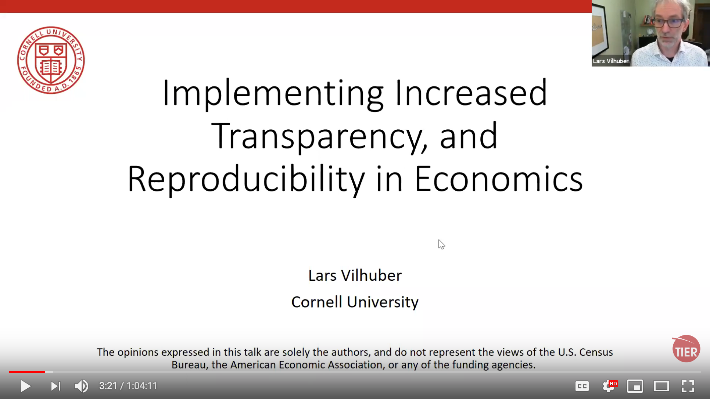

# Pre-training tasks {#pre-training}

We ask that trainees accomplish a few tasks prior to the first training session. 

Please do the following:

- The training is virtual, using video, and we frequently meet virtually. Please review our [Video Etiquette rules](https://github.com/labordynamicsinstitute/replicability-training/wiki/Videoconferencing-Rules-and-Etiquette) (they are useful beyond our group as well)
- View [my recent talk on the background of the lab](https://www.youtube.com/watch?v=rLoeNzOApFk)), including what we do, and why we do it. 

- Review our [Privacy] Policy
  - Your privacy
  - The privacy of authors

- Go through our [Setup Checklist](setup_checklist.md) and install necessary software

---