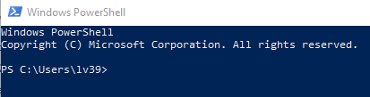

# Testing that Git works

## Using A Command Line Tool



```
cd .\Documents\
mkdir Workspace
cd .\Workspace\
```

## Check out this repository

In your browser, open this repository: 
https://github.com/larsvilhuber/jobcreationblog

```
git clone https://github.com/larsvilhuber/jobcreationblog.git
cd jobcreationblog
```

## What can you say about this repository?

```
git status
git remote -v
git log
```
*(hit `q` to get out of the log viewer)*