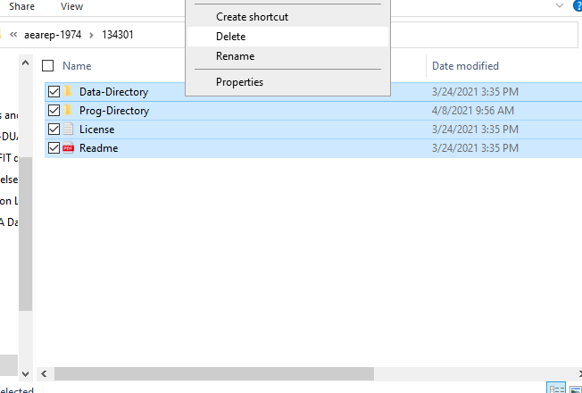
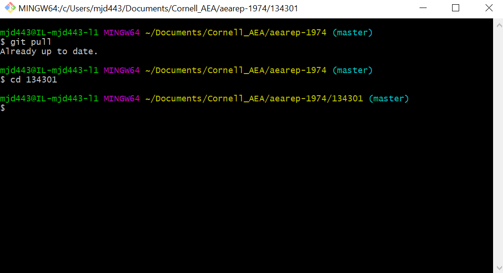
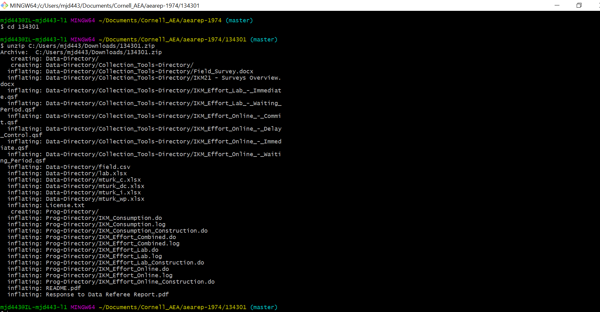

# Updating Replication Materials

While you move through the [revision workflow](https://labordynamicsinstitute.github.io/replicability-training-curriculum/aea-revision-reports-after-author-resubmission.html), step **12.3.2 Code** instructs you to download the updated ICPSR deposit and commit the files to the Bitbucket repository. This document will detail the most efficient way of executing this process.

1. On the ICPSR deposit, navigate to "View Log" under "Share Project" and "Change Owner." This log will tell you all the changes that have been made to the deposit and when. Verify that changes have been made to the deposit since the recent revisions were requested. If no changes have been made since the previous round, it may be a sign that the authors have created a new deposit instead of updating their existing deposit. If no changes have been made, contact a supervisor.  
2. Download the ICPSR deposit.
3. Navigate to the existing aearep-xxxx directory on you workspace.
4. Within the directory on your workspace click into the ICPSR folder (i.e. 123456).
5. Move any important files (results, logs, etc.) from the first round to their own subfolder of the root directory.
6. Navigate back to the root directory (aearep-xxxx), right click and select "Git Bash Here" to open a bash shell.
7. Select everything and delete. It is extremely important that you do this manually through the file explorer and **NOT** through "git rm"
    

8. In the bash shell, cd into the ICPSR folder.
    

9. In the bash shell, unzip the download of the updated ICPSR deposit (example: unzip path/to/Downloads/123456.zip).
    

10. In the bash shell, type "cd .." to move back to the root directory.
11. In the bash shell, type "git status" to see what files are new, modified, or deleted.
12. Git add, commit, push the updated ICPSR folder.
13. In Bitbucket, you should be able to see the specific changes made to any files (with the same naming convention), that were modified.

*Note:* If the structure of the directory is different or files have been renamed, git will treat them as new files instead of allowing you to view specific modifications.