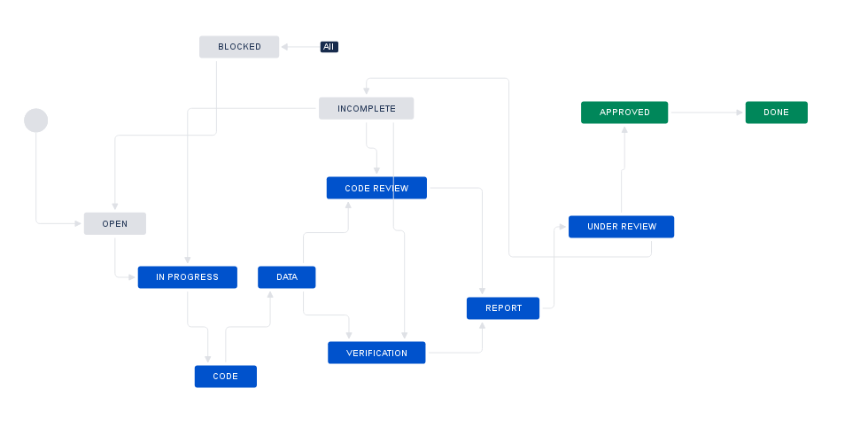

# Training for Jira-based workflow

For pre-publication verification, we use a Jira-based workflow quite similar to the post-publication processes described in the [Wiki](https://github.com/labordynamicsinstitute/replicability-training/wiki).

## Scope
Your supervisor will assign you to this workflow if needed. This workflow covers code and data, even when data may not be accessible.

This workflow does NOT cover assessment of data citations. This is covered by a different training.

## Overview

The following table illustrates the flow and transitions. The `transition` field identifies the button that will appear in the interface
that needs to be clicked in order to progress an issue from the `From` state to the `To` state. The `Condition` field identifies
which form field needs to be filled out in order to be able to make the transition. `Blocked` is always an option, and leads to a "waiting state"
until a resolution can be found.

| From         | Transition           | → To           | Condition |
|:-------------|:---------------------|:---------------|:----------|
| Open         | Start task           | → In Progress  |           |
| In Progress  | Download code        | → Code         | `Entry questionnaire`, `Code provenance` have been filled out, `Journal` has been identified. |
| Code         | Access data          | →	Data          | `Git working location` has been filled out. |
| Data         | Data is accessible   | →	Verification  | `Location of data` has been filled out.|
| .            | Data not available   | →	Code review   | `Reason for non-accessibility of data` has been filled out.|
| Verification | Prepare report       | →	Report        | |
| Code review  | Prepare report       | →	Report        | |
| Report       | Submit for review    | →	Under Review  | `Report URL` has been filled out.|
| Under Review | Approve              | →  Approved    |Can only be done by **approvers**.|
| .            | Incomplete           | →  Incomplete  | n.a.      |
| Approved     | Done                 | → 	Done         | n.a.      |
| Incomplete   | Restart              | →  Code review |           |
| .            | Restart verification | → Verification |           |
| .            | Restart task         | → In Progress  |           |
| Blocked      | Reopen               | →  Open        | n.a.      |

### Notes
- The Entry Questionnaire is different for pre-publication verifications. Please consult with your supervisor.
- In the Issue form, please also fill out other fields, as noted.
- If code and/or data are provided by email, `Code provenance` should be filled out with  "email", otherwise with a URL.
- There are no drop-down menus, but once a value has been entered, it becomes available for future use. E.g., once `Stata` has been entered in software, it becomes a choice for future entries, and should be re-used.
- All code should be stored on Bitbucket Git repositories. When committing, always use [Smart Commits](https://confluence.atlassian.com/bitbucket/use-smart-commits-298979931.html)
- Data should be stored locally (currently) / in [Git LFS](https://confluence.atlassian.com/bitbucket/git-large-file-storage-in-bitbucket-829078514.html) (soon)

## Details
Additional details for each of the key stages are provided here.

### In Progress

At this stage, you are collecting information. 
- start by [creating a repository](https://github.com/labordynamicsinstitute/replicability-training/wiki/Setting-up-a-repository-on-Bitbucket) 
  - the repository name should be the name of the JIRA issue (e.g., `AEJPOLICY-5`)
  - populate the repository with the [template](https://github.com/AEADataEditor/replication-template/releases/latest/) as needed, delete unused files.
- Establish a list of Datasets used, and use this to guide you later when filling out the **Data Citation and Information** report (see  the Jira project for the link)
- Establish a list of the Tables and Figures in the paper, and use this to guide you in [REPLICATION.md](https://github.com/AEADataEditor/replication-template/blob/master/REPLICATION.md).
- Fill out the **Entry Questionnaire** (see  the Jira project for the link)
- Then fill out the Jira form, in particular the following fields
  - `Entry questionnaire` - date the Entry Questionnaire was filled out
  - `Code provenance` - location of the code (programs) package - this can be email, or a particular location
  - `Journal` has been identified.
  - `Manuscript Central identifier`  has been noted (optional, if available)

### Code
In this stage, download the code, and populate the Bitbucket repository. see above how to handle data. Once you have filled out the form with the location of the repository (e.g. `https://bitbucket.org/aeaverification/aearep-2/src/master/`), you can proceed to the next stage.

### Data
Referring back to your list of datasets, assess whether at least part of the code can be run. 

- If nothing can be run, fill out `Reason for non-accessibility of data` and continue to `Code Review`. 
- If at least some of the code can be run, identify the `Data provenance`  (where you got the data from: email, URL, Github, Dropbox, etc.) and `Location of data`  (where you put the data, which can be CISER, laptop, or Git LFS, or somewhere else), and proceed to start `Verification`.

### Prepare Report
In this stage, you are verifying the code, either using the provided data, or by inspecting the completeness of the source code. The [REPLICATION.md](https://github.com/AEADataEditor/replication-template/blob/master/REPLICATION.md) is the report.

To complete this stage, enter the direct URL of the report, i.e., in the relevant repository:
> https://bitbucket.org/aeaverification/aearep-2/src/master/REPLICATION.md

At this time, you can submit the report for review. 
