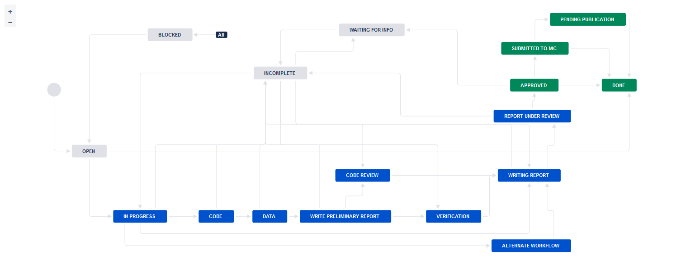
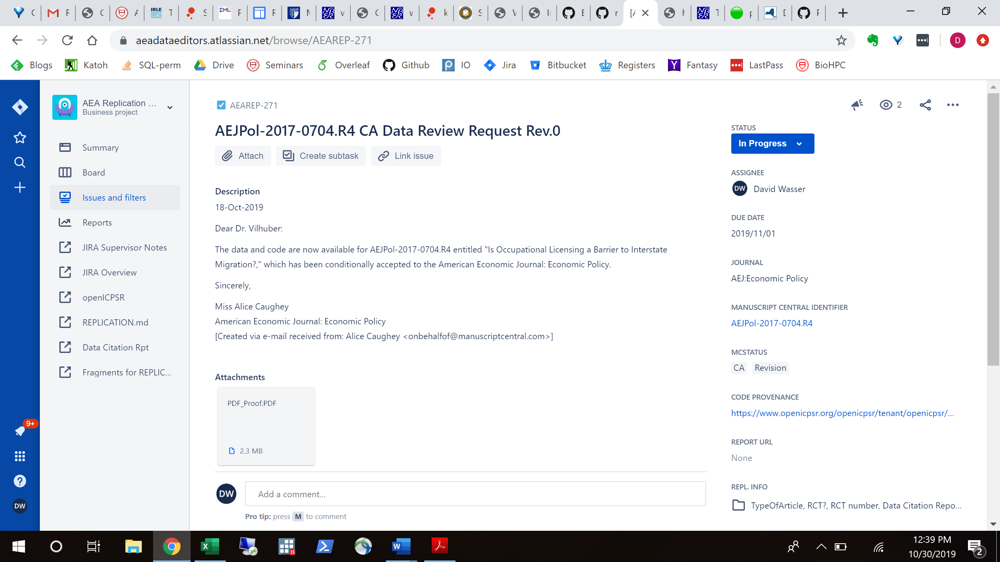

# Training for Jira-based workflow

For pre-publication verification, we use a Jira-based workflow similar to the post-publication processes described in the [Wiki](https://github.com/labordynamicsinstitute/replicability-training/wiki).

**Pre-publication verification is a priority and should be completed within a week of being assigned.**
- Typically these replications involve interacting with [openICPSR repositories](openICPSR_training.md) where code and data are stored.
- In addition to the information you will fill out in Jira, there is also a separate Data Citation Report (more on that below)

## Scope
Your supervisor will assign you to this workflow. This workflow covers code and data, even when data may not be accessible. Supervisor, see [other document](jira-supervisor-notes.md) for details.

This workflow **DOES NOT** cover assessment of data citations. This is covered by a different training.

## Overview

The following table illustrates the flow and transitions. The `transition` field identifies the button that will appear in the interface
that needs to be clicked in order to progress an issue from the `From` state to the `To` state. The `Condition` field identifies
which form field needs to be filled out in order to be able to make the transition. `Blocked` is always an option, and leads to a "waiting state"
until a resolution can be found.

| From         | Transition           | → To           | Condition |
|:-------------|:---------------------|:---------------|:----------|
| Assigned     | Start task           | → In Progress  |           |
| In Progress  | Download code        | → Code         | `Code provenance` have been filled out, `Journal` has been identified. |
| Code         | Access data          | →	Data          | `Git working location` has been filled out. |
| Data         | Prepare preliminary report | → Write Preliminary Report | |
| Write Preliminary Report | Data is accessible   | →	Verification  | `Location of data` has been filled out.|
| .            | Data not available   | →	Code review   | `Reason for non-accessibility of data` has been filled out.|
| Verification, Code review  | Prepare report       | →	Report        | |
| Report       | Submit for review    | →	Under Review  | `Report URL` has been filled out.|
| Multiple     | Need information     | → Incomplete   |  when information is missing |
| Incomplete   | Restart              | →  Code review |           |
| .            | Restart verification | → Verification |           |
| .            | Restart task         | → In Progress  |           |

The following are only relevant for "Approvers" (if you have not been told you are an "Approver", you are not.)

| From         | Transition           | → To           | Condition |
|:-------------|:---------------------|:---------------|:----------|
| Open         | Assign               | →  Assigned    |           |
| In Progress  | Alternate Workflow   | →  Alternate Workflow | |
| Under Review | Approve              | →  Approved    |Can only be done by **approvers**.|
| .            | Incomplete           | →  Incomplete  | n.a.      |
| Approved     | Done                 | → 	Done       | n.a.      |
| Blocked      | Reopen               | →  Open        | n.a.      |

### Notes
- In the **Issue form**, please also fill out other fields, as noted.
- At any point, you can move the issue to `Incomplete`: more information/action is required before you can proceed. You should also notify us of the situation ASAP
- When committing, **always** use [Smart Commits](https://confluence.atlassian.com/bitbucket/use-smart-commits-298979931.html), e.g.
> JRA-34 #comment corrected indent issue
- Use JIRA to communicate with your supervisor as issues arise, including code that takes a long time to run. 

## Details
Additional details for each of the key stages are provided here. Below is a screenshot of a Jira ticket. Some things to note:
  - The blue `In Progress` box in the upper right is how you "advance" the Jira ticket. When you are first assigned a replication, this box will say `Open`.
  - The tall grey bar on the left side contains several handy links that you will use throughout the process.
    - Sometimes this box is not visible. To make it visible, edit the URL for the Jira ticket so that there are no characters after the ticket number (e.g. AEAREP-123). You may have to refresh the page after doing so.

### In Progress
The first thing you must do is advance the ticket from `Open` to `In Progress`.

- This lets us know that you have started working on replication.

At this stage, you are collecting information. 
- [ ] start by [creating a repository](https://bitbucket.org/repo/create) (for detailed instructions, see the [Wiki page](https://github.com/labordynamicsinstitute/replicability-training/wiki/Setting-up-a-repository-on-Bitbucket))
  - the repository name should be the name of the JIRA issue (e.g., `aearep-123`)
  - Be sure that `aeaverification` is always the "owner" of the report on Bitbucket. 
- [ ] populate the repository with the latest version of the [template](https://github.com/AEADataEditor/replication-template) 
  - delete unused files from the template! Then `git add` those that you keep around
  - The root of the repository should contain only our files (i.e., REPLICATION.md, etc.) and the manuscript files (main manuscript, any online appendices and README files provided through the JIRA ticket)
- [ ] Then fill out the following fields in the Jira ticket (some may be pre-populated):
  - [ ] `Code provenance` In almost all cases, this is the openICPSR repo for which you will have received a notification email.
    - If code and/or data are provided by email, `Code provenance` should be filled out with  "https://email", otherwise with a URL.
  - [ ] `Journal` 
  - [ ] `Manuscript Central identifier`
  - [ ] `Bitbucket short name` (e.g., `aearep-123`) - this should auto-fill the `Git working location`.
- The following fields, located in the REPL. INFO tab on the bottom right of your Jira ticket, must also be filled out:
  - [ ] `TYPEOFARTICLE` "Does the article contain empirical work, simulations, or experimental work?" - typically the answer should be "Yes". You should answer "No" only if you read the article and find that it is entirely theoretical, no simulations or empirical work at all.
  - [ ] `RCT` Is the paper about a randomized control trial? This should be immediately obvious from the abstract.
    - `RCT NUMBER` If it is an RCT, fill in the associated RCT registration number (typically in the title page footnote)
  
You can now proceed to change the status to `Code`.

### Code
In this stage, download the code or the entire replication package, and populate the Bitbucket repository.
- [ ] Download the code from openICPSR (typicaly for most cases). See [openICPSR repositories](openICPSR_training.md) for instructions on downloading these materials.
- [ ] Populate the Bitbucket repository:
  - Use `git clone` to clone the Bitbucket repository onto your local computer. It should be named something like `aearep-123`.
  - Copy/paste the downloaded openICPSR folder into the local copy of the `aearep-123` repository. The local repository should now have the relevant LDI replication template materials and the openICPSR folder containing the replication materials provided by the authors.
   - The manuscript's files should be in a subdirectory (e.g, `paper_archive` or `111234`, the openICPSR repository number). Often this is created by the author-provided ZIP file - re-use it.
  - Perform a `git add`, `git commit`, `git push` sequence to populate the Bitbucket repo with the authors' replication materials (see above how to handle data).

Now you will establish a **list of Datasets used** and fill out the **Data Citation and Information** report.
- From the **README** provided by the authors, the **data section** of the article itself, or an **appendix**, establish a list of datasets used in the article.
- [ ] Now you will fill out the **[Data Citation and Information](https://goo.gl/forms/3IaMu6PCG7P7WhK43)** report:
  - A [link to the report](https://goo.gl/forms/3IaMu6PCG7P7WhK43) can be found in the tall grey bar on the left side of the ticket. If this tall grey bar is not visible, then edit the url according to the directions above.
  - [ ] Fill out the `DATA CITATION REPORT` field on Jira with the date on which you complete this report.
  - Use the list of datasets to guide you when filling this out.
  - [ ] **AT THE SAME TIME:** write the corresponding `Data description` section of REPLICATION.md. This should provide detail about the datasets that are not obvious from the **Data Citation and Information** 
- [ ] Add the list of datasets to the repository by committing the preliminary version of the REPLICATION.md (`git add`, `git commit`)

Do a first pass through the code files provided:

- [ ] review the code in detail. 
- [ ] In the template, you will find `[code-check.xlsx](https://github.com/AEADataEditor/replication-template/blob/master/code-check.xlsx)`. Use this to create a list of all Tables and Figures in the paper, and use this to guide you in [REPLICATION.md](https://github.com/AEADataEditor/replication-template/blob/master/REPLICATION.md).
- [ ] Fill out the "Code Description" section of the REPLICATION.md
  - Provide some information about the program files (are there 3 Stata files? Are there 5 Matlab programs?). You will use this information to fill out the `Software Used` later as well, but provide details here.
  - Did you have difficulty aligning the README with the files? Does the sequence suggested by the programs differ from what's written in the README? 
  - Are there files in the archive not explained in the README?
  - [EXPERT TIP] You do **not** need to run the code at this time, only read the program code! (You can do this on your laptop)

Next fill out the following fields in the Jira ticket:
options (e.g. start typing "Stata" and you will see it pop up).
  - [ ] `BITBUCKET SHORT NAME` - if not already done earlier

> Commit! 

You can now proceed to change the status to `Data`. As you select that transition, you will be asked various questions:
  - [ ] `Software Used` Start typing the name of the software program you will use for the replication. Software that have been used in the past will show up as  
  - [ ] `PROGRAMSEQUENCE` Does the README tell you the correct sequence for running the code?
  - [ ] `PROGRAMSDOCUMENTATION` Are the provided programs well commented? Are they documented in the README?
  - [ ] `PROGRAMSSTRUCTUREMANUAL` Does the README note any manual changes that you need to make to the code in order for it to run?

### Data

- [ ] Download the data (if not already done in the previous step).
  - Data should be stored locally (currently) / in [Git LFS](https://confluence.atlassian.com/bitbucket/git-large-file-storage-in-bitbucket-829078514.html) (soon)
- [ ] Run the PII-checking code, review the output, and record the result in the REPLICATION.md
- [ ] Describe the data 
  - [ ] do relevant variables have labels? 
  - [ ] Is the data readable?
  - [ ] Is the data in archive-ready formats (`csv` or `txt` are the preferred formats by librarians, but `dta` or `spss` are also OK; `mat` files are discouraged)

Fill out the following Jira fields:
  - [ ] `DATA PROVENANCE` Where, specifically, are you accessing the data? Typically this is the openICPSR repo URL (same as `CODE PROVENANCE`), but may be a user-provided URL or DOI.
  - [ ] `WORKING LOCATION OF THE DATA` Where did you put the data? Examples: CISER, laptop, or Git LFS, or somewhere else

You can now proceed to change the status to `Write Preliminary Report`. You will be asked to provide additional information:

  - [ ] `DATAAVAILABILITYACESS` Is at least some of the data available?
  - [ ] `DATAAVAILABILITYEXCLUSIVE` Is there data that is **only** accessible to the author (nobody else)?
  - [ ] `REASON FOR NON-ACCESSIBILITY OF DATA` Fill this out if **none** of the code can be run
  - [ ] `NUMBEROFDATASETS` How many datasets are used in the article? 
  - [ ] `DATASETSINCLUDED` How many of the datasets used in the article are actually provided by the authors?   

### Write Preliminary Report 
At this stage, you need to fill out the REPLICATION.md up to the "Replication steps" part. 
- There is sample language for commonly encountered problems at the [Fragments for REPLICATION.md](https://raw.githubusercontent.com/AEADataEditor/aea-de-guidance/master/sample-language-report.md) link in the tall grey bar
  - [EXPERT TIP] Right-click, and open the sample language in a new tab, for easy reference.
- [ ] Commit this preliminary report to the Bitbucket repository.

This stage allows for earlier identification of  issues that might warrant changes to the procedure. 
  - In particular, this is the stage where you might have identified that some, but not all data are not provided, and we can undertake steps there.

> Commit! 

- Advance the ticket to one of three options: `Verification`, `Code Review`, or `Incomplete`
  - `Verification`: at least some of the data is accessible. In order to progress to this state,
    - [ ] `Working location of data`has to be filled out
    - [ ] `Computing environment` has to be selected.
  - `Code Review`: none of the data is accessible
  - `Incomplete`: more information/action is required before you can proceed

### Verification
In this stage, you are verifying the code, by using the provided data, or by inspecting the completeness of the source code. The [REPLICATION.md](https://github.com/AEADataEditor/replication-template/blob/master/REPLICATION.md) is the report.

Keep a log of what you do, what you find, and what does not work, in the `REPLICATION.md`, under *Findings*.

Follow the steps [here](https://github.com/labordynamicsinstitute/replicability-training/wiki/Prepare_and_run_replication)

You should commit your report with intermediate results as you have them. Do __not__ wait until you have all the results finished. Commit frequently!

> Add! Commit!

You can now proceed to change the status to `Writing Report`.

### Code Review
In this stage, you are verifying the code by inspecting the completeness of the source code. In general, your ability to detect any issues is limited, but go through the code one more time, and identify 
- packages that are installed late in the code, but not mentioned in a setup program or the README
- commands that your experience shows require packages to be installed, but are not mentioned.

The [REPLICATION.md](https://github.com/AEADataEditor/replication-template/blob/master/REPLICATION.md) is the report.

> Add! Commit!

You can now proceed to change the status to `Writing Report`.

### Writing Report
At this stage, you will write the final version of the report.
- There is sample language for commonly encountered problems at the [Fragments for REPLICATION.md](https://raw.githubusercontent.com/AEADataEditor/aea-de-guidance/master/sample-language-report.md) link in the tall grey bar
- Clean up the REPLICATION.md - it should be factual, objective, and not written in the first person.
- Delete all of the instructional lines in REPLICATION.md  before finishing the report.

To complete this stage, enter the direct URL of the report, i.e., in the relevant repository (if not already pre-filled):
> https://bitbucket.org/aeaverification/aearep-123/src/master/REPLICATION.md

You can now submit your report for review by changing the status to `Under Review`

## Replication Revisions
- See [revision guidance](https://github.com/labordynamicsinstitute/replicability-training/wiki/Revision-to-a-Replication) on the wiki.
- When receiving updated files from authors, do NOT create "update" or "new" directories. The current state of the repository should always correspond to the author's structure. Overwrite files, delete files. The previous state is preserved in Git. This will also tell you what files have changed.
- When running a second replication on the same archive, please be sure to have the committed "REPLICATION.md" be accurate when you commit it - do not let it contain holdover data from a previous replication attempt, as this can lead to confusion.
